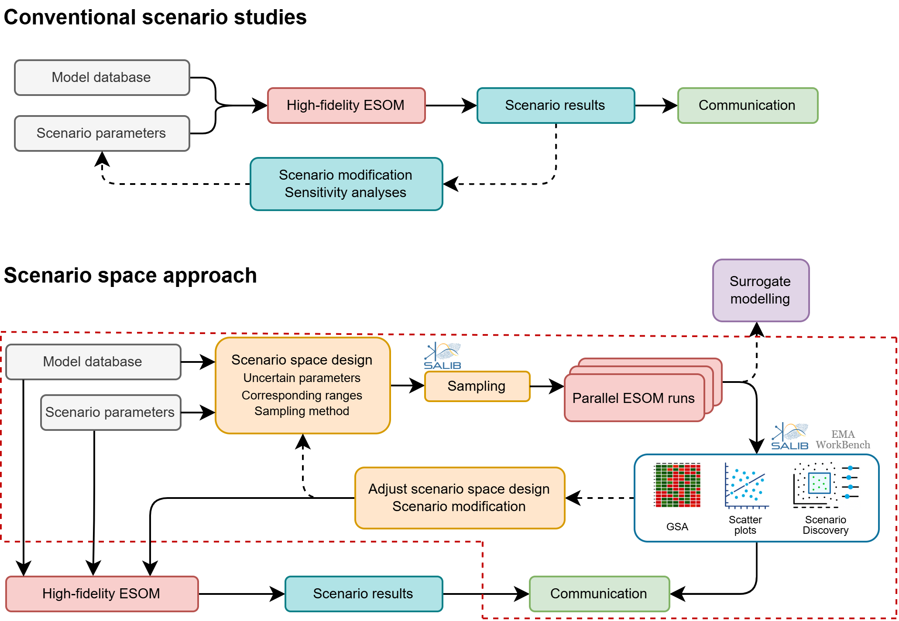

# Scenario-space exploration for energy-system optimisation models



Data, figures and model accompanying the paper *Scenario Space Exploration for
Robust Energy Planning*, applied to the Dutch net-zero energy system in 2050.

Open **`index.html`** for the interactive figure browser (also served live via
Netlify, since this repo is connected to a Netlify site). Every figure printed
in the article is redrawn there from the same numbers, so it can be zoomed,
hovered and read off directly. Nothing is recomputed in the browser: this is a
reader for the published results, not an analysis tool.

Double-clicking the file works locally too. There is no build step and no
server needed, because each dataset ships twice, as `data/figN.json` for
anything that reads the numbers and as `data/figN.js` for the page itself,
which a browser will load from a `file://` page where it refuses to fetch
JSON. If you would rather serve it locally:

```
python -m http.server        # then open http://localhost:8000
```

> **Sep 2026 update:** the dashboard is no longer a Streamlit app. It is now a
> static site (plain HTML/CSS/JS, powered by Plotly) deployed on Netlify, with
> no server-side code, no RAM limits and no cold starts. The previous
> Streamlit-based UI and the AIMMS model it depended on are preserved on the
> `Old` branch for reference.

## What is here

| Path | Contents |
|---|---|
| `index.html`, `assets/` | The interactive browser. No build step, no server-side code. |
| `figures/` | Every figure at publication resolution, numbered as in the article. |
| `data/` | The numbers behind each figure, one JSON file per figure. |
| `results/` | Every model input and output, and every analysis result. |
| `model/` | IESA-Opt in Julia, with the input workbooks and the configuration used. |

### Model input

| File | Contents |
|---|---|
| `model/input/1108 SSP.xlsx` | The scenario database: technologies, costs, potentials, demands |
| `model/input/default_data.xlsx` | Default parameter values and time series |

That is the whole input. The model builds a cache of clustered time series and
context binaries on first run, which is large but derived; it is not shipped
because it is reproducible from these two workbooks.

### Ensemble input and output

| File | Contents |
|---|---|
| `results/ensemble/parameter_sample_lhs.csv` | The 10,000 sampled parameter vectors, 31 inputs each |
| `results/ensemble/parameter_sample_morris.csv` | The 3,200-point Morris trajectory design |
| `results/ensemble/kpi_outputs_lhs.csv.gz` | Model outcomes for every evaluation, including the 13 infeasible |
| `results/ensemble/kpi_outputs_morris.csv.gz` | Model outcomes for the Morris design |
| `results/ensemble/kpi_outputs_reference.csv` | The reference case |
| `results/ensemble/technology_capacity.parquet` | Installed capacity by technology, every run |
| `results/ensemble/technology_use.parquet` | Annual use by technology, every run |
| `results/ensemble/prices.parquet` | Commodity shadow prices, every run |
| `results/ensemble/chemistry_tech_use.csv.gz` | Production by chemical route, behind Figure 4 |

The three Parquet files stay in that format because as gzipped CSV they are
several times larger, and pandas, R via arrow, Julia and DuckDB all read Parquet
in one line:

```python
import pandas as pd
cap = pd.read_parquet("results/ensemble/technology_capacity.parquet")
```

### Analysis results

| File | Contents |
|---|---|
| `results/gsa/delta_indices.csv` | Moment-independent sensitivity index for every input-outcome pair |
| `results/gsa/morris_indices.csv` | Morris μ\* and σ for every input-outcome pair |
| `results/gsa/delta_significance.csv` | Permutation floor per pair, and whether the index clears it |
| `results/gsa/convergence_curves.json` | Both metrics against sample size, behind Figure A1 |
| `results/gsa/range_narrowing.csv` | Retention of the leading inputs when each range is narrowed |
| `results/prim/prim_box_metrics.csv` | Mass, density, held-out density and coverage per case |
| `results/prim/prim_box_restrictions.csv` | Every retained restriction with its quasi-*p* value |
| `results/prim/settings_sweep.csv` | Box quality across peeling rate and minimum mass |
| `results/prim/out_of_sample_validation.csv` | Train and test density under repeated splitting |
| `results/prim/second_boxes.csv` | Alternative boxes for each target |
| `results/fidelity/hourly_fidelity.csv` | The twenty scenarios re-solved at full hourly resolution |

## The ensemble

10,000 Latin hypercube evaluations and 3,200 Morris evaluations over 31 uncertain
inputs, 13,200 model runs in total. Of the Latin hypercube sample, 9,987 solved to
optimality and 13 were infeasible; those 13 are a result rather than a failure and
are analysed in Figure A3.

A further 26 runs are excluded from price-based analysis. The ensemble is solved
with the barrier algorithm without crossover, which leaves the dual solution
degenerate in a small number of runs and produces implausible shadow prices. The
criterion is a CO₂ price above 2,000 EUR/t or a total system cost above
70,000 MEUR. It is applied to price-based figures only; the feasibility analysis
uses the complete design. The analysis frame therefore has 9,974 rows.

## The model

`model/` holds IESA-Opt, a linear whole-system optimisation model of the Dutch
energy system, written in Julia, together with the two input workbooks it reads.
Running it needs Julia and Gurobi; an academic Gurobi licence is free.

```
julia --project=model
] instantiate
```

Each ensemble member is one deterministic solve at 3-hourly resolution, 2,920
chronological time slices for 2050, taking of the order of 250 seconds. The full
ensemble is embarrassingly parallel and was run on a single 128-core workstation.

The per-run solver artefacts, roughly 140,000 files, are not shipped. They are
the unconsolidated form of the panels in `results/ensemble/`, which carry the
same numbers keyed by `variant_id`.

## How to read the figures

The interactive versions carry the same numbers as the printed ones, with three
differences that only a screen allows.

Hovering gives the value under the cursor, which matters most in Figure 2, where
a 31 by 17 grid is unreadable cell by cell on paper. Dragging zooms into a
region and double-clicking resets, which matters in Figure 3 and Figure 7, where
several thousand points overlap. Figure 2 also lets you switch between the two
sensitivity metrics and turn the direction colouring off, so the magnitude can be
read on its own.

Two cautions carry over from the paper. The sign in Figure 2 is a descriptive
average association, not a directional or causal sensitivity, and any sign that
matters to a conclusion should be checked against the response panels in
Figure 3. In Figure 7, held-out density is the number to believe; the in-sample
density is optimistic by construction, because the box was selected to maximise
it.

## Deployment

This repo is connected to Netlify (`netlify.toml`: publish the repo root, no
build command — it is already a static site). Pushing to `main` redeploys the
live site automatically.

## Licence

The repo overall is under the [MIT License](LICENSE). The Julia model in
`model/` carries its own licence, in `model/LICENSE`. Please cite the paper if
you use this material.
